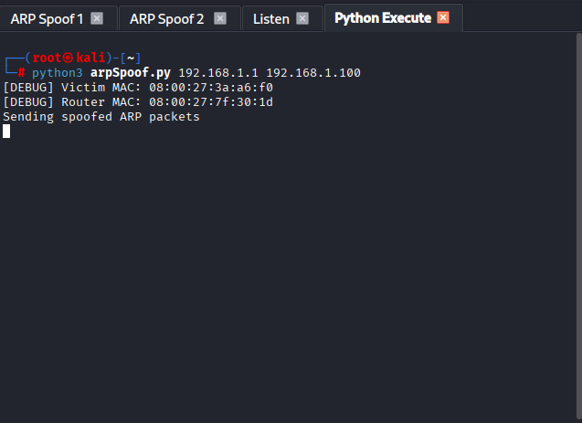
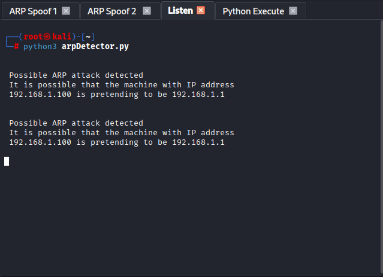

# ARP Spoofing Detection Lab

This lab simulates ARP spoofing using Scapy and detects it in real time with a custom Python script. It's part of my attacker emulation and layered detection logic portfolio.

## 🔧 Lab Setup

- **Environment:** VirtualBox with Kali Linux and Metasploitable2
- **Network Mode:** Bridged Adapter, Promiscuous Mode: Deny
- **Interface:** eth0
- **Victim IP:** 192.168.1.100  
- **Router IP:** 192.168.1.1  
- **Attacker MAC:** VirtualBox-generated (e.g., `08:00:27:xx:xx:xx`)

## 🧪 Simulation Flow

1. `arpSpoof.py` sends crafted ARP replies to poison victim and router ARP tables.
2. `arpDetector.py` monitors ARP traffic and alerts when a MAC address claims a new IP.
3. Detection logic is triggered when spoofed packets are observed.

## 📜 Scripts

### `arpSpoof.py`
Performs ARP spoofing using Scapy with Ethernet layer wrapping and MAC resolution.

### `arpDetector.py`
Sniffs ARP packets and compares MAC-IP mappings to detect spoofing attempts.

## 📸 Screenshots

| Spoofing Output | Detection Alert |
|-----------------|-----------------|
|  |  |

> All IPs and MACs shown are from a private lab environment. No real-world systems are exposed.

## 🚀 Next Steps

- Integrate with Suricata and Splunk for layered detection pipelines
- Expand attacker emulation scenarios (e.g., DNS spoofing, ICMP redirection)
- Log detections and generate alerts for SOC workflows

## 📚 Tags

`#CyberSecurity` `#ARPspoofing` `#DetectionEngineering` `#Scapy` `#PythonSecurity` `#AttackerEmulation` `#VirtualLab`
